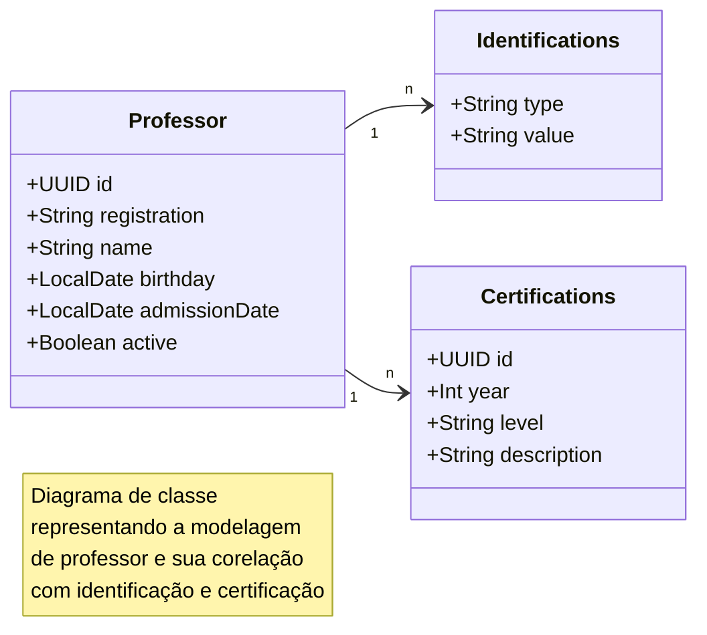

```mermaid
classDiagram
    direction LR
    note "Diagrama de classe 
    representando a modelagem 
    de professor e sua corelação
    com identificação e certificação"
    class Professor {
        +UUID id
        +String registration
        +String name
        +LocalDate birthday
        +LocalDate admissionDate
        +Boolean active
    }
    

    class Identifications {
        +String type
        +String value
    }

    class Certifications {
        +UUID id
        +Int year
        +String level
        +String description
    }
    Professor "1" --> "n" Identifications
    Professor "1" --> "n" Certifications
```