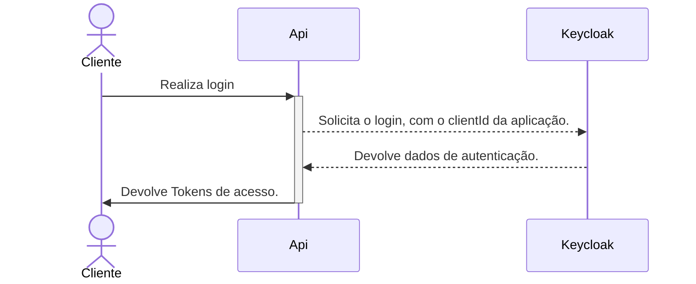
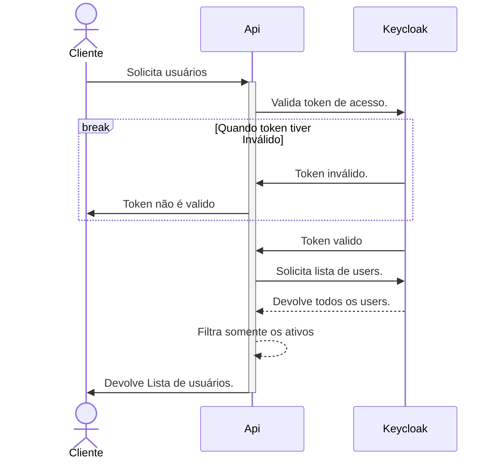

# backend-g3

Código sendo desenvolvido pela equipe 3 da turma de CSW 2023/02 PUCRS, ministrada pelo professor Eduardo Arruda

Até o momento, é suportado o crud voltado para os clientes.
Todo o sistema de gerenciamento de senhas de cadastros são armazenados no keycloak
Seguindo o seguinte fluxo:

Login:

Busca Todos usuarios:

